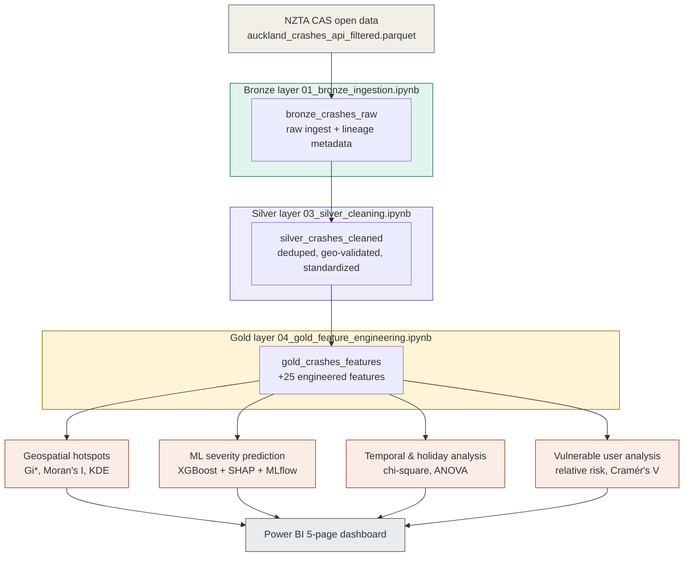

#  Auckland Crash Analysis  Medallion Architecture BI & ML Platform
>  [Full Report (PDF)](MBI908_Assessment_3_Sneha.pdf) ·  [Dashboard Export (PDF)](Power_BI_Report_Dashboard.pdf) ·  [Power BI file (.pbit)](MBI908_Project_Modified_24th.pbit) · [Presentation](Presentation_Sneha.pptx)

---

##  Table of Contents

1. [Project Overview](#-project-overview)
2. [Business Problem & Research Objectives](#-business-problem--research-objectives)
3. [Data Source](#-data-source)
4. [Architecture  Medallion Data Pipeline](#-architecture--medallion-data-pipeline)
5. [Tech Stack](#-tech-stack)
6. [Bronze Layer  Ingestion](#-bronze-layer--ingestion)
7. [Silver Layer  Cleaning & Validation](#-silver-layer--cleaning--validation)
8. [Gold Layer  Feature Engineering](#-gold-layer--feature-engineering)
9. [Analysis 1  Geospatial Hotspot Detection](#-analysis-1--geospatial-hotspot-detection)
10. [Analysis 2  Machine Learning Severity Prediction](#-analysis-2--machine-learning-severity-prediction)
11. [Analysis 3  Temporal & Holiday Analysis](#-analysis-3--temporal--holiday-analysis)
12. [Analysis 4  Vulnerable Road User Risk](#-analysis-4--vulnerable-road-user-risk)
13. [Power BI Dashboard](#-power-bi-dashboard)
14. [Key Findings & Recommendations](#-key-findings--recommendations)
15. [Repository Structure](#-repository-structure)
16. [How to Run This Project](#-how-to-run-this-project)
17. [Limitations & Ethical Considerations](#-limitations--ethical-considerations)

---

##  Project Overview

Road safety in Auckland is a persistent public health problem, but crash data on its own doesn't tell decision-makers *where* to act, *which* crashes are most preventable, or *who* is most at risk. This project builds an end-to-end analytics platform on **10 years of NZTA Crash Analysis System (CAS) data (2015–2025, 111,657 crash records)** to answer exactly that  using a production-grade **Bronze–Silver–Gold Medallion Architecture** on Microsoft Fabric, four distinct analytical methods, and a stakeholder-facing Power BI dashboard.

---

##  Business Problem & Research Objectives

**Research question:** 
Q.1 Where do high-severity crashes cluster in Auckland?
Q.2 What factors predict crash severity?
Q.3 Which road users and time periods carry the greatest risk?
Q.4 What should Auckland Transport / NZTA do about it?

| # | Objective | Method | Notebook |
|---|-----------|--------|----------|
| 1 | Identify statistically significant crash hotspots | Getis-Ord Gi* + Moran's I spatial autocorrelation | `05_geospatial_analysis.ipynb` |
| 2 | Predict crash severity from road/environmental conditions | XGBoost + SHAP explainability, MLflow-tracked | `06_machine_learning_models.ipynb` |
| 3 | Test whether holiday periods carry elevated severity risk | Chi-square test, Cramér's V, ANOVA | `07_temporal_analysis.ipynb` |
| 4 | Quantify relative risk for pedestrians, cyclists, motorcyclists | Relative risk ratio, Cramér's V per risk factor | `08_vulnerable_user_analysis.ipynb` |
| 5 | Translate findings into an interactive decision-support tool | 5-page Power BI dashboard | `Power_BI_Report_Dashboard.pdf` |

---

##  Data Source

| Attribute | Detail |
|---|---|
| **Source** | [NZTA Crash Analysis System (CAS)](https://www.nzta.govt.nz/safety/safety-resources/road-safety-information-and-tools/crash-analysis-system/)  public open data |
| **Coverage** | Auckland region, 2015–2025 |
| **Volume** | 111,657 crash records (post-cleaning), ~85 raw columns |
| **Format** | Parquet, ingested via Microsoft Fabric OneLake |
| **Key fields** | Location (X/Y coordinates), severity, weather, lighting, road character, speed limit, vulnerable user flags, holiday period |
| **Known gap** | CAS public data does not include crash **hour**  acknowledged explicitly in the analysis and factored into the ML model's realistic performance ceiling |

---

##  Architecture  Medallion Data Pipeline



Every layer is a physical **Delta Lake table**, not a transient dataframe  each stage can be audited, re-run independently, or picked up fresh by re-reading the previous layer's table, which is the core discipline of Medallion Architecture.

---

##  Bronze Layer  Ingestion

[`01_bronze_ingestion.ipynb`](01_bronze_ingestion.ipynb) reads the raw parquet file from Fabric OneLake, adds **data lineage metadata** (ingestion timestamp, source file, data source, year range), and writes it as a Delta table:

```python
df_bronze = df \
    .withColumn("ingestion_timestamp", F.current_timestamp()) \
    .withColumn("source_file", F.lit("auckland_crashes_api_filtered.parquet")) \
    .withColumn("data_source", F.lit("NZTA CAS Open Data Portal")) \
    .withColumn("year_range", F.lit("2015-2025")) \
    .withColumn("bronze_record_id", F.monotonically_increasing_id())

df_bronze.write.format("delta").mode("overwrite") \
    .option("overwriteSchema", "true").saveAsTable("bronze_crashes_raw")
```

A built-in **data quality report** immediately follows  record count, date range, missing coordinates, severity distribution, and geographic bounds  establishing a quality baseline before any cleaning happens. [`02_data_dictionary.ipynb`](02_data_dictionary.ipynb) then auto-generates a full column-level data dictionary (type, nullability, sample values) directly from the Bronze schema, saved as its own Delta table for downstream reference.

---

##  Silver Layer  Cleaning & Validation

[`03_silver_cleaning.ipynb`](03_silver_cleaning.ipynb) applies a 7-step, fully logged cleaning pipeline:

| Step | Action |
|---|---|
| 1 | Remove duplicates on `objectId` (unique crash identifier) |
| 2 | Drop records with missing X/Y coordinates (can't be geospatially analyzed) |
| 3 | Validate against Auckland geographic bounds (174.45–175.25°E, -37.15 to -36.65°S)  drop out-of-region records |
| 4 | Standardize severity labels (`"Fatal Crash"` → `Fatal`, etc.) |
| 5 | Fix data types (year, speed limit, lane count → integer) and validate year range 2015–2025 |
| 6 | Create binary user-type flags (`has_bicycle`, `has_pedestrian`, `has_motorcycle`, etc.) using `coalesce` to correctly handle nulls |
| 7 | Final validation + write to `silver_crashes_cleaned` |

Every step prints a before/after record count, so data loss at each stage is fully auditable rather than silent.

---

##  Gold Layer  Feature Engineering

[`04_gold_feature_engineering.ipynb`](04_gold_feature_engineering.ipynb) turns cleaned records into an ML- and BI-ready feature table  **25 engineered features** across four categories:

- **Temporal:** `financial_year_start`, `holiday_type`
- **Spatial:** `distance_from_cbd_km` (Haversine-approximated from Auckland CBD), `area_type` (Urban/Suburban/Rural by speed limit), `is_cbd_area`
- **Interaction:** `wet_and_dark`, `poor_visibility`, `frost_risk`, `high_speed_hill`, `advisory_speed_delta`
- **Derived / target:** `multi_vehicle`, `is_intersection`, `complex_traffic_control`, `vulnerable_user_involved`, and the three ML target variables  `severe_crash` (binary), `severity_numeric` (ordinal 0–3), `is_fatal` (binary)

```python
df_gold = df_gold.withColumn(
    "distance_from_cbd_km",
    F.round(F.sqrt(
        F.pow((F.col("Y") - F.lit(AUCKLAND_CBD_LAT)) * 111, 2) +
        F.pow((F.col("X") - F.lit(AUCKLAND_CBD_LON)) * 111 * F.cos(F.radians(F.col("Y"))), 2)
    ), 2)
)
```

Result: `gold_crashes_features`, the single feature table every downstream analysis (geospatial, ML, temporal, vulnerable user) reads from independently.

---


## Tech Stack

| Layer | Tools |
|---|---|
| **Platform** | Microsoft Fabric (Lakehouse, OneLake, notebooks) |
| **Data engineering** | PySpark, Delta Lake (Bronze/Silver/Gold Medallion Architecture) |
| **Geospatial analysis** | GeoPandas, PySAL, esda (Getis-Ord Gi*, Moran's I), scikit-learn (KDE), Folium |
| **Machine learning** | scikit-learn (Logistic Regression, Random Forest), XGBoost, imbalanced-learn (SMOTE), SHAP |
| **Experiment tracking** | MLflow |
| **Statistics** | SciPy (chi-square, ANOVA, linear regression) |
| **Visualization** | Power BI, Matplotlib, Folium |
| **Reporting** | Academic research report (PDF), stakeholder presentation (PPTX) |

---

##  Analysis 1  Geospatial Hotspot Detection

[`05_geospatial_analysis.ipynb`](05_geospatial_analysis.ipynb) runs a genuine spatial statistics workflow, not just a heatmap:

1. **1km × 1km grid** overlaid on Auckland; crashes spatially joined to grid cells
2. **Getis-Ord Gi\*** statistic computed per cell (999 permutations, distance-band spatial weights at 2km) to find *statistically significant* clustering  not just visually dense areas
3. **Moran's I** computed globally to confirm crashes exhibit genuine positive spatial autocorrelation before trusting the Gi* results
4. **Kernel Density Estimation (KDE)** run separately on severe crashes only, with a custom peak-finding algorithm that enforces ≥5km separation between reported hotspots (avoiding the naive-argsort trap of reporting 10 peaks from the same 2km area)
5. Each hotspot cross-referenced back to `crashLocation1` to attach real road names

```python
gi_grid = G_Local(grid_active['gi_weight'].values, w_grid, permutations=999, seed=42)
grid_active['gi_star_z'] = gi_grid.Zs
grid_active['gi_star_p'] = gi_grid.p_sim
```

**Result:** 36 statistically significant hotspot cells identified along the SH1/Southern Motorway corridor, with the Grafton–CBD zone reaching 99% confidence, validated by a significant positive Moran's I.

---

##  Analysis 2  Machine Learning Severity Prediction

[`06_machine_learning_models.ipynb`](06_machine_learning_models.ipynb) trains and compares **three models** to predict `severe_crash` (Fatal/Serious vs. Minor/Non-Injury), with every run logged to **MLflow**:
- **Class imbalance handled properly**: `SMOTE` applied to the training set only (never the test set), with an 80/20 stratified split
- **Feature selection was deliberate, not automatic**  features with >90% zero-variance were explicitly identified and dropped before modeling, and the notebook documents *why* each retained feature earns its place
- **Three models compared** under identical splits: Logistic Regression (scaled, `class_weight='balanced'`), Random Forest (tuned for recall), and XGBoost (custom decision threshold at 0.35, `scale_pos_weight` for imbalance)
- **SHAP TreeExplainer** run on the XGBoost model for feature-level explainability, not just a feature-importance bar chart

```python
with mlflow.start_run(run_name="XGBoost"):
    xgb_m = xgb.XGBClassifier(
        n_estimators=300, max_depth=6, learning_rate=0.05,
        min_child_weight=3, subsample=0.8, colsample_bytree=0.8,
        scale_pos_weight=scale_pw, random_state=42
    )
    xgb_m.fit(X_train_bal, y_train_bal, eval_set=[(X_test, y_test)], verbose=False)
    mlflow.log_metrics({"roc_auc": roc_xgb, "recall": r_xgb, "f1": f1_xgb})
```

| Model | ROC-AUC | Recall | Precision |
|---|---|---|---|
| Logistic Regression (baseline) | 0.73 | 0.58 | 0.12 |
| Random Forest | 0.71 | 0.43 | 0.16 |
| **XGBoost** | **0.72** | **0.64** | 0.08 |

XGBoost was selected as the operational model because **recall matters more than precision for this use case**  missing a genuinely severe crash pattern is a worse outcome than over-flagging safe locations for review. SHAP identified **vulnerable user involvement** and **lighting conditions** as the two strongest predictors of severity, ahead of intersection type, lane count, and traffic control.

> The notebook is explicit that ROC-AUC is capped by a real data limitation  CAS public data excludes crash hour and driver behavior variables  rather than presenting the ~0.72 AUC as a ceiling the model simply failed to reach.

---

##  Analysis 3  Temporal & Holiday Analysis

[`07_temporal_analysis.ipynb`](07_temporal_analysis.ipynb) tests whether public holiday periods carry elevated crash severity risk, using a chi-square test of independence, Cramér's V for effect size, and a year-over-year linear trend:

```python
chi2, p_chi, dof, expected = chi2_contingency(ct)
cramers_v = np.sqrt(chi2 / (n * (min(ct.shape) - 1)))
# Chi2 = 10.09, p = 0.018, Cramer's V = 0.0095
```

**Result, reported honestly:** the holiday–severity association is **statistically significant (p = 0.018) but the effect size is negligible (Cramér's V = 0.0095)**. Labour Weekend shows the highest severity rate (6.3%, +1.47 percentage points above the non-holiday baseline of 4.8%), while Christmas/New Year has the highest crash *volume* (2,326 crashes) without a proportionally elevated severity rate. The analysis draws the correct conclusion from this: road and environmental conditions (captured by the ML model) are stronger severity determinants than holiday timing alone  this isn't spun into a bigger finding than the statistics support.

---

##  Analysis 4  Vulnerable Road User Risk

[`08_vulnerable_user_analysis.ipynb`](08_vulnerable_user_analysis.ipynb) is the project's strongest single finding:

```
Vulnerable user crashes : 11,458  (10.3% of all crashes)
Severe rate  VU        : 23.7%
Severe rate  non-VU    : 2.6%
Relative risk           : 8.95×
```

Crashes involving a pedestrian, cyclist, or motorcyclist are **8.95 times more likely** to result in a fatal or serious injury than vehicle-only crashes. The notebook breaks this down by user type (pedestrians 4.1%, motorcyclists 4.1%, cyclists 2.2% of all crashes) and by road/environmental risk factor (road lane type, lighting, urban classification  each tested with chi-square and ranked by Cramér's V), then translates the finding directly into a **cost-benefit estimate** using official NZ crash cost figures (cost per fatality: $4.84M; cost per serious injury: $662K) to quantify the annual benefit of a 10% reduction in vulnerable-user severe crashes through infrastructure investment.

---

##  Power BI Dashboard

A 5-page interactive dashboard ([full PDF export](Power_BI_Report_Dashboard.pdf), [.pbit template](MBI908_Project_Modified_24th.pbit)) turns all four analyses into a single decision-support tool, built directly on the Gold-layer CSV exports from [`09_files.ipynb`](09_files.ipynb).

**1. Overview**  112K total crashes, 377 fatal crashes, severity trend by year, top crash locations by name (Karangahape Road, Mount Wellington, Great South Road).


**2. Spatial Hotspot Analysis**  an interactive map of the 36 statistically significant hotspot cells (95%/99% confidence tiers), with Moran's I (0.62) displayed alongside the hotspot table for full statistical transparency.


**3. Predictive Severity Model**  model comparison table, ROC-AUC by model, a SHAP feature-importance ranking, and a map of high-risk crash locations (predicted probability ≥ 0.90) for operational patrol targeting.


**4. Temporal & Holiday Analysis**  holiday severity vs. baseline, annual crash trend (down from a 2017 peak), and the chi-square/Cramér's V statistics surfaced directly on the dashboard rather than hidden in an appendix.


**5. Vulnerable User Analysis**  the 8.95× relative risk headline metric, risk factors ranked by Cramér's V, and a geographic map of crashes by user type.


---

##  Key Findings & Recommendations

| # | Finding (statistically validated) | Recommendation |
|---|---|---|
| 1 | **36 statistically significant crash hotspots** cluster along the SH1/Southern Motorway corridor; Grafton–CBD reaches 99% confidence (Getis-Ord Gi*, confirmed by significant positive Moran's I) | Prioritize infrastructure audits and enforcement resourcing at the identified hotspot cells, not a uniform region-wide approach |
| 2 | **Lighting conditions and vulnerable user involvement** are the strongest SHAP-ranked predictors of crash severity  ahead of intersection type and lane count | Targeted lighting improvements at flagged high-risk, low-light locations |
| 3 | Vulnerable road users are **8.95× more likely** to suffer a fatal/serious injury (23.7% vs. 2.6% severe rate) | Specialised infrastructure (separated cycle lanes, pedestrian crossings) at the specific corridors identified in the vulnerable-user location breakdown |
| 4 | Holiday–severity association is statistically significant but **practically negligible** (Cramér's V = 0.0095); Labour Weekend has the highest severity rate (6.3%) | Targeted, not calendar-wide, enforcement  specifically Labour Weekend rural/open-road routes where the severity uplift concentrates |
| 5 | XGBoost achieves ROC-AUC 0.72 / Recall 0.64 for severity prediction, with a known ceiling due to the absence of crash-hour data in the public CAS dataset | Use the model's high-risk location map (probability ≥ 0.90) to guide ML-informed patrol routing, while treating the model as a prioritization aid, not a certainty |

Twelve evidence-informed recommendations in total are detailed in the [full report](MBI908_Assessment_3_Sneha.pdf), estimated to deliver a combined annual benefit when implemented together.

---

##  Repository Structure

```
Crash_Analysis/
│
├── 00_setup_environment.ipynb          # Package installation (geopandas, pysal, xgboost, shap, etc.)
├── 01_bronze_ingestion.ipynb           # Raw parquet → bronze_crashes_raw (Delta), lineage metadata
├── 02_data_dictionary.ipynb            # Auto-generated column-level data dictionary
├── 03_silver_cleaning.ipynb            # 7-step cleaning → silver_crashes_cleaned
├── 04_gold_feature_engineering.ipynb   # 25 engineered features → gold_crashes_features
├── 05_geospatial_analysis.ipynb        # Getis-Ord Gi*, Moran's I, KDE hotspot detection
├── 06_machine_learning_models.ipynb    # LR / RF / XGBoost + SMOTE + SHAP, MLflow-tracked
├── 07_temporal_analysis.ipynb          # Chi-square, Cramér's V, ANOVA, annual trend
├── 08_vulnerable_user_analysis.ipynb   # Relative risk, cost-benefit ROI modeling
├── 09_files.ipynb                      # Exports Gold tables to CSV for Power BI
│
├── MBI908_Project_Modified_24th.pbit   # Power BI template (5-page dashboard)
├── Power_BI_Report_Dashboard.pdf       # Full dashboard export (all 5 pages)
├── MBI908_Assessment_3_Sneha.pdf       # Full written research report
├── Presentation_Sneha.pptx             # Stakeholder presentation deck
├── assets/screenshots/                 # Dashboard page screenshots (used in this README)
├── LICENSE
└── README.md
```

---

##  How to Run This Project

This project is built for **Microsoft Fabric** (PySpark notebooks + Delta Lake + OneLake), not a local Python environment  the ingestion notebook reads from an `abfss://` OneLake path, and every layer writes/reads Delta tables via `spark.table(...)`.

**1. Set up a Fabric workspace**
Create a Fabric Lakehouse and upload the source parquet file (`auckland_crashes_api_filtered.parquet`) to `Files/`.

**2. Run the notebooks in order**
```
00_setup_environment.ipynb        # installs geopandas, pysal, xgboost, shap, etc.
01_bronze_ingestion.ipynb         # creates bronze_crashes_raw
02_data_dictionary.ipynb          # documents the bronze schema
03_silver_cleaning.ipynb          # creates silver_crashes_cleaned
04_gold_feature_engineering.ipynb # creates gold_crashes_features
```

**3. Run the four analytical notebooks** (each reads independently from `gold_crashes_features`, can be run in any order)
```
05_geospatial_analysis.ipynb
06_machine_learning_models.ipynb
07_temporal_analysis.ipynb
08_vulnerable_user_analysis.ipynb
```

**4. Export for Power BI**
```
09_files.ipynb   # writes Gold analysis tables to Files/powerbi_export/*.csv
```

**5. Open the dashboard**
Open [`MBI908_Project_Modified_24th.pbit`](MBI908_Project_Modified_24th.pbit) in Power BI Desktop and point it at the exported CSVs, or connect directly to the Fabric Lakehouse SQL endpoint.

**No Fabric workspace available?** View the static exports: [dashboard PDF](Power_BI_Report_Dashboard.pdf) and [full report](MBI908_Assessment_3_Sneha.pdf).

---

##  Limitations & Ethical Considerations

- **No crash-hour data**: the public CAS dataset excludes time-of-day, which caps the ML model's achievable performance and is explicitly acknowledged rather than glossed over.
- **Te Tiriti o Waitangi**: the research explicitly considers ethical and cultural responsibilities in data stewardship when working with public safety data affecting Māori and all New Zealand communities.
- **Standard ML practice adapted to context**: techniques like SMOTE and SHAP are applied with New Zealand-specific transport context in mind (e.g. holiday periods specific to the NZ calendar, road classifications specific to NZTA's system) rather than applied generically.
- **Correlation, not causation**: hotspot and risk-factor findings identify statistical association, not proven causal mechanisms  recommendations are framed as prioritization guidance for further engineering/enforcement investigation, not as final causal conclusions.

---


